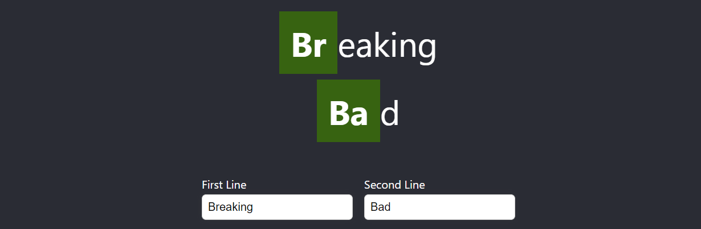

# Breaking Bad logo generator challenge

## Given
- An array of periodic element strings e.g. ['Br', 'B', ...]
- A component with 2 input fields and basic markup.

##  Challenge
### Extend the logo generator component that it

 - handles user input on the 2 input elements
 - checks each input value for the **first** occurence of a periodic element string
 - renders prepared input values in 2 lines (the logo)
 - highlights the first found periodic element for each logo line

The component to extend is located in `src/challenges/BreakingBadGenerator.tsx`.

## Hints

### Best way to walk through this challenge is to:
1. Implement basic input handling
2. Implement value preparation for periodic ocurrences
3. Implement rendering of the logo

### Setup
- The React app renders your component on the root route.
- Creation of components and utilities is welcome to separate concerns.
- Styling must not be perfect.